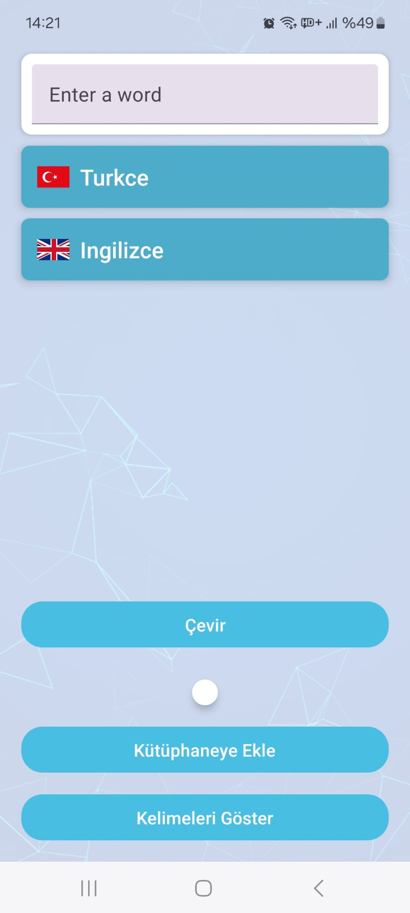
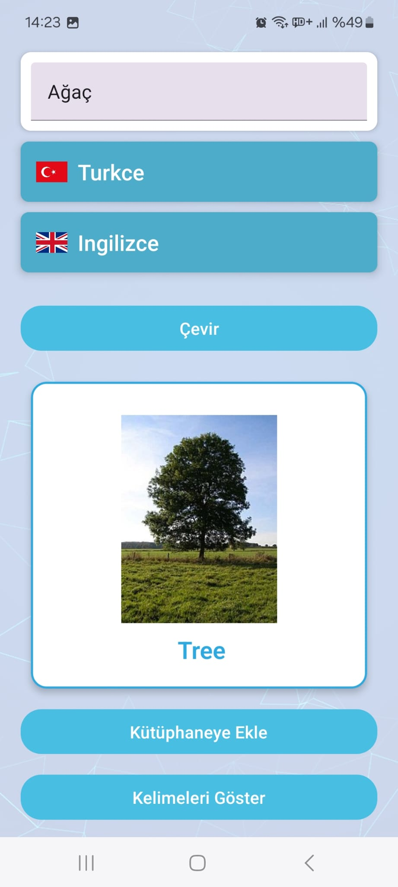
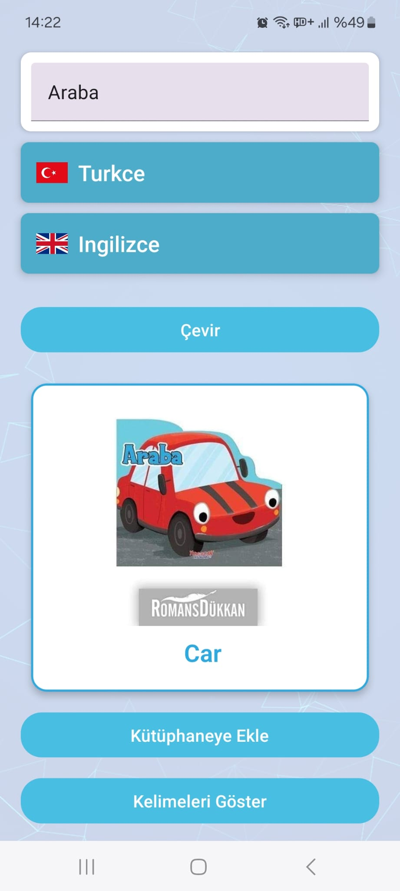
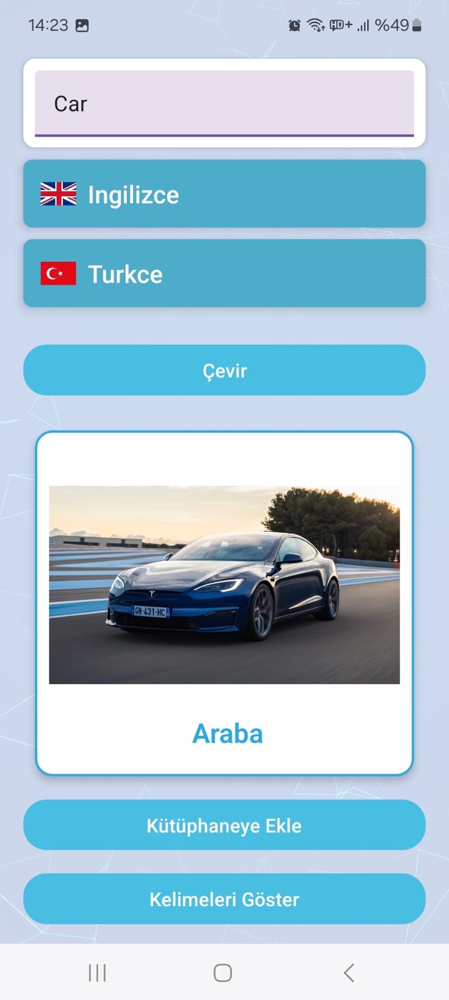
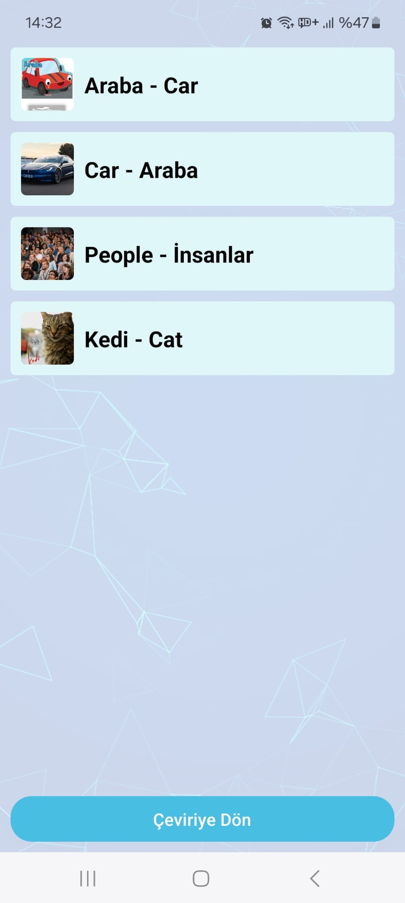
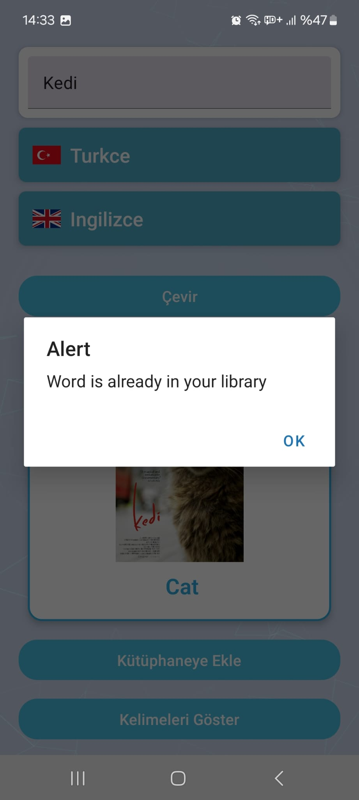
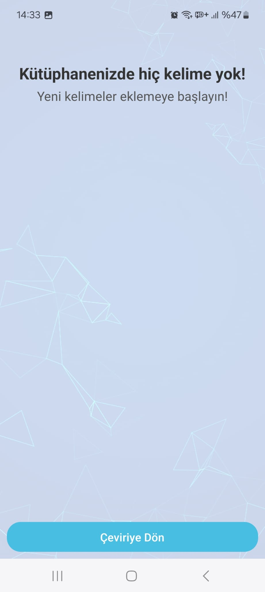

# Turkish-English Dictionary App 📚

This mobile app allows you to translate words between Turkish and English and find pictures that match the word meanings.

## Features
- Fast word translation between Turkish and English
- Image search feature
- Save and delete a word in the library
- Local data storage (using AsyncStorage)

  ## Screenshots
  
   
   
   
   
   
   

   ## Installation
1. Clone this repo: `git clone https://github.com/kullanıcı_adı/proje_adı.git`
2. Go to the folder: `cd project_name`
3. Install the necessary dependencies: `npm install`
4. Run the application: `expo start`

   ## Usage
- Enter a word in the word search field and see the translation.
- Click on the “Search Image” button to add an image.

  ## Technologies Used
- React Native
- Expo
- AsyncStorage
- Axios (for API calls)
- Google Custom Search API (for image search)

  ## Contribution
If you would like to contribute, please send a pull request or open an issue.
   
 
